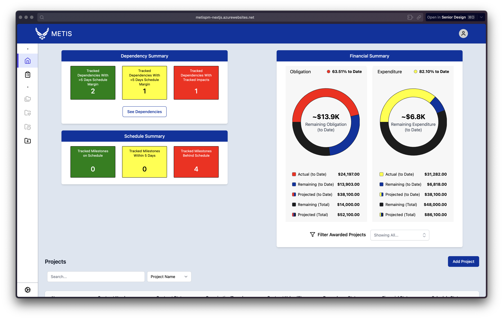

   
  

  <h3 align="center">USAF Project Management Dashboard</h3>

  

    Senior Design Spr/Fall 2023
  

<h2>Authors</h2>
<ul>
  <li>Gani Begawala</li>
  <li>Sophia Caffery</li>
  <li>Jonathan Gilbert</li>
  <li>Maxwell Graeser</li>
  <li>Michael Vuolo</li>
</ul>

*And the original [Senior Design Team](https://github.com/KatPrend/USAF-Dashboard/graphs/contributors) that initially released the project using [React Router](https://reactrouter.com).*

<h2>About The Project</h2>

This project is an extension of a previous year's [Senior Design Project](https://www.eecs.ucf.edu/cssd) located [here](https://github.com/KatPrend/USAF-Dashboard).

We were tasked with improving the original source code, with the initial requirements proposed by our sponsor:
<ul>
  <li>Data Visualization</li>
  <ul>
    <li>Tailored Gantt Charts (With Multiple Projects)</li>
    <li>Dependency Visualizations</li>
  </ul>
  <li>User-Tailored Dashboard Views</li>
  <ul>
    <li>Based on User Roles/Interests</li>
    <li>Implementation of Tiles</li>
  </ul>
  <li>Incorporation of AI-Based Solutions</li>
  <ul>
    <li>Prediction of Issues</li>
  </ul>
  <li>Resolution of Backlog List Items</li>
  <ul>
    <li>Using Agile Approaches</li>
  </ul>
</ul

To start off - we switched the previous team's tech stack up a bit. Here's what we changed:
  1. Switched our framework from [React Router](https://reactrouter.com) to [Next.js](https://nextjs.org)
  2. Converted all JavaScript files to [TypeScript](https://www.typescriptlang.org)
  3. Added [Prisma](https://www.prisma.io) for SQL Injection prevention (a serious issue that was present in the previous team's source code)
  4. Replaced [Express](https://expressjs.com) with [tRPC](https://trpc.io) to ensure API [type-safety](https://en.wikipedia.org/wiki/Type_safety) from the front-end client to the back-end server
 
<h2>Usage</h2>

To run locally, follow the following steps:
  1. Download the SQL script that sets up the database table (Note: It's not hosted here yet, so use [this file](https://github.com/KatPrend/USAF-Dashboard/blob/main/Backend/usaf-dash_2022-11-12.sql) for now)
     - Make sure to create two users named `usaf` and `usaf_admin` with appropriate privileges
  2. Run `npm install` to install the node packages
  3. Duplicate [.env.example](https://github.com/vuolo/USAF-Project-Management-Dashboard/blob/main/.env.example) and rename it to `.env`, and fill it in with the appropriate contents
  4. Run `npx prisma db push` to push the new database schema (that includes authentication) to the SQL server
  5. Run `npm run dev` to start the local development server
